# Part 1 : A brief History of Multirate in Faust

## 2009: Semantics of multirate Faust

The always-active monorate model is simple, but not always sufficient.

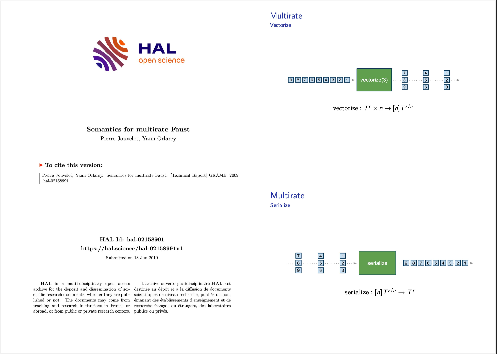


## 2015: Mute, Enable and Control

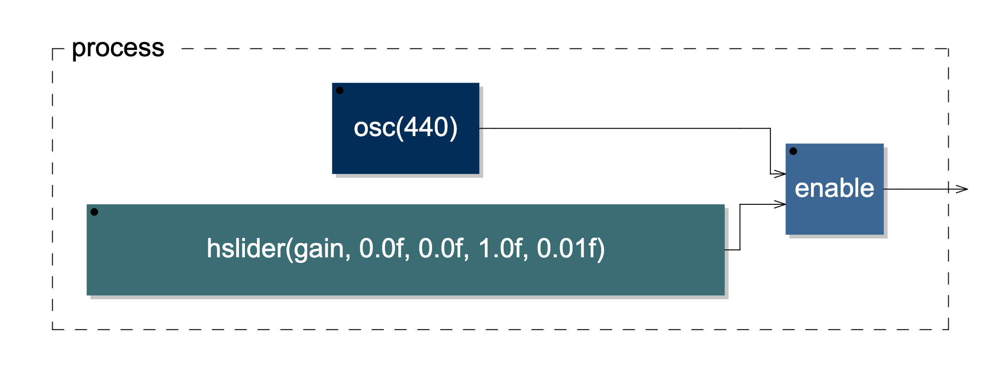

- 2015: `mute(x,y)` like `x*y` but the computation of `x` can be suspend when `y` is 0.
- Later, `mute`  was renamed to `enable`, and a `control` variant was added.
- 2021: extended to `-vec` mode.

## 2020: Ondemand

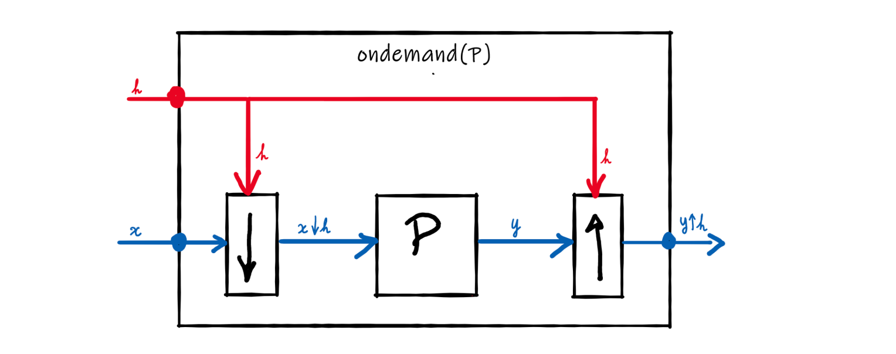

- 2020: Till Bovermann asks for _demand-rate computations_
- 2020: Specification of _ondemand_
- 2022: Proof of concept presented at IFC-22
- 2024: _Ondemand_ officially introduced at IFC-24

# Part 2 : Ondemand

## Introduction

### Objective

Provide _multirate_ and _call-by-need_ computation while preserving _efficiency_ and _simple semantics_

### Multirate Computation

- Frequency domain
- Upsampling
- Downsampling

### call-by-need

- Pay for what you use
- Controlling when computations occur
- Music composition-style computation


## call-by-need strategy

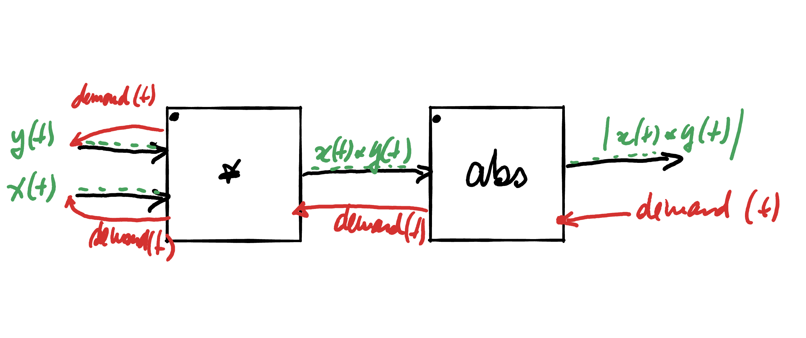

### Computations are only performed when explicitly required

- The demand (red arrow) is propagated backwards, starting from the outputs and moving towards the inputs.
- In response,  the computed values (green arrows) are propagated forwards, moving from the inputs to the outputs.
- The output values remain constant until the next demand.

## Ondemand Semantics

`ondemand(C)` applies `C` to downsampled input signals ($S_i<*H$), producing upsampled results ($Y_j*>H$). Here, $H$ is the clock signal.

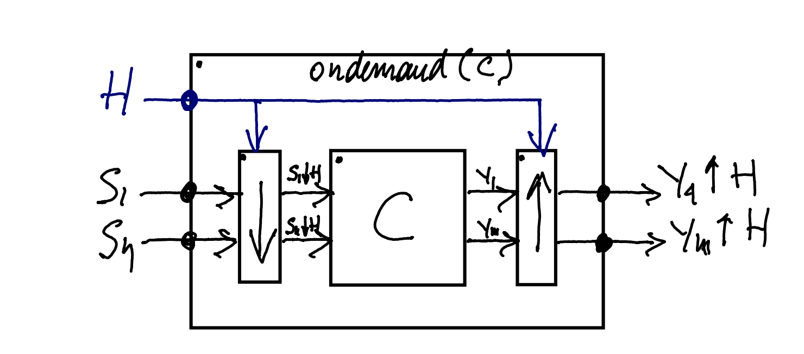


### Semantic rule

$$
\inference[(od)]{
    \semc{C}(S_1<*H,...,S_n<*H) = (Y_1,...,Y_m)\\
}{
    \semc{\od{C}}(H,S_1,...,S_n) = (Y_1*>H,...,Y_m*>H)
} 
$$ 


## Downsampling

The downsampled $S_i<*H$ is computed from $S_i$, based on the clock signal $H$. $t$ is the time observed outside `C`, and $t'$ inside.

\begin{table}[!ht]
\centering
\begin{tabular}{cccccc}
\hline
$t$ & $S_i$  & $H$   & $S_i<*H$  & $\down{H}$ & $t'$ \\ \hline
0   &  a     & 1     & a         & 0          & 0   \\
1   &  b     & 0     & .         & .          & .   \\
2   &  c     & 0     & .         & .          & .   \\
3   &  d     & 1     & d         & 3          & 1   \\
4   &  f     & 1     & f         & 4          & 2   \\
5   &  g     & 0     & .         & .          & .   \\ \hline
\end{tabular}
\caption{Example of downsampling}
\label{tab:downsampling}
\end{table}

### Semantic rule

$$
\inference[(down)]{
\down{H} = \{n\in\N <> \sems{H}(n)=1\}
}{
\sems{S_i<*H}(t) = \sems{S_i}(\down{H}(t))
}
$$


## Upsampling

$S_i*>H$ is the upsampling of $S_i$ according to clock signal $H$.  $t$ is the time observed outside `C`, and $t'$ inside.

\begin{table}[!ht]
\centering 
\begin{tabular}{cccccc}
\hline
$t'$ & $S_i$ & $H$   & $S_i*>H$  & $\up{H}$ &$t$  \\ \hline
0    & a     & 1     & a         & 0        & 0 \\
1    & d     & 0     & a         & 0        & 1 \\
2    & f     & 0     & a         & 0        & 2 \\
.    & .     & 1     & d         & 1        & 3 \\
.    & .     & 1     & f         & 2        & 4 \\
.    & .     & 0     & f         & 2        & 5 \\ \hline
\end{tabular}
\caption{Example of upsampling}
\label{tab:upsampling}
\end{table}

### Semantic rule

$$
\inference[(up)]{
\up{H}(t) = \sum_{i=0}^t \sems{H}(i) - 1
}{
\sems{S_i*>H}(t) = \sems{S_i}(\up{H}(t))
}
$$

## Example 1: Sample and Hold

`ondemand` simplifies the implementation of a _Sample and Hold_ (SH)circuit. It is directly expressed as the `ondemand` version of the identity function `_`.

### 1: without ondemand

```faust
SH = (X,_:select2) ~ _ with { X = _,_ <: !,_,_,!; };
```

### 2: with ondemand


```faust
SH = ondemand(_);
```

## Example 1: Generated code

### 1: without ondemand

```C
for (int i=0; i<count; i++) {
    fVec0SE[0] = ((int((float)input0[i])) ? 
                 (float)input1[i] : fVec0SE[1]);
    output0[i] = (FAUSTFLOAT)(fVec0SE[0]); 
    fVec0SE[1] = fVec0SE[0];
}
```

### 2: with ondemand


```C
for (int i=0; i<count; i++) {
    fTemp0SE = (float)input1[i]; 
    if ((float)input0[i]) {
        fPermVar0SE = fTemp0SE;
    }
    output0[i] = (FAUSTFLOAT)(fPermVar0SE); 
}
```


## Example 2: downsampled noise, without ondemand


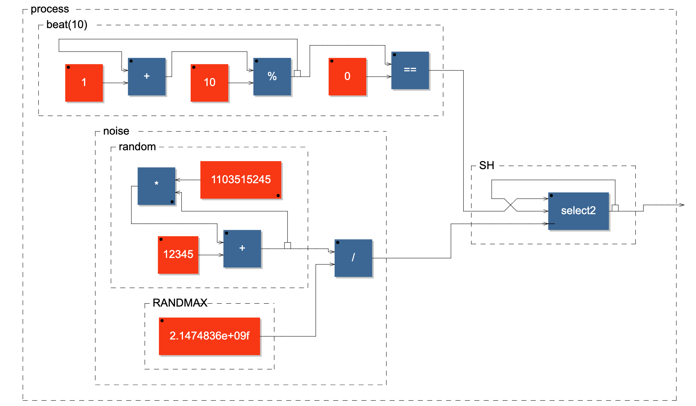

### Faust code

```C
process = ba.beat(100), no.noise : SH;
```


## Example 2: downsampled noise, with ondemand

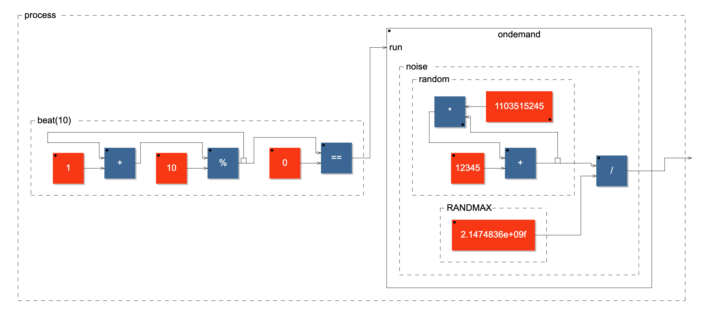


### Faust code

```C
process = ba.beat(100) : ondemand(no.noise);
```


## Example 2: Generated code, without ondemand

### Code generated for `ba.beat(100), no.noise : SH`
```C
for (int i=0; i<count; i++) {
    iVec0SI[0] = ((iVec0SI[1] + 1) % 100);
    iVec3SI[0] = ((1103515245 * iVec3SI[1]) + 12345);
    fVec2SI[0] = (((iVec0SI[0] == 0)) ? 
                 (4.656613e-10f * float(iVec3SI[0])) 
                 : fVec2SI[1]);
    output0[i] = (FAUSTFLOAT)(fVec2SI[0]);
    fVec2SI[1] = fVec2SI[0];
    iVec3SI[1] = iVec3SI[0];
    iVec0SI[1] = iVec0SI[0];
}
```


## Example 2: Generated code, with ondemand

### Code generated for `ba.beat(100) : ondemand(no.noise)`
```C
for (int i=0; i<count; i++) {
    iVec0SI[0] = ((iVec0SI[1] + 1) % 100);
    if ((iVec0SI[0] == 0)) {
        iVec2SI[0] = ((1103515245 * iVec2SI[1]) + 12345);
        fPermVar0SI = (4.656613e-10f * float(iVec2SI[0]));
        iVec2SI[1] = iVec2SI[0];
    }
    output0[i] = (FAUSTFLOAT)(fPermVar0SI);  
    iVec0SI[1] = iVec0SI[0];
}
```

# Part 3 : ondemand variants

## Oversampling

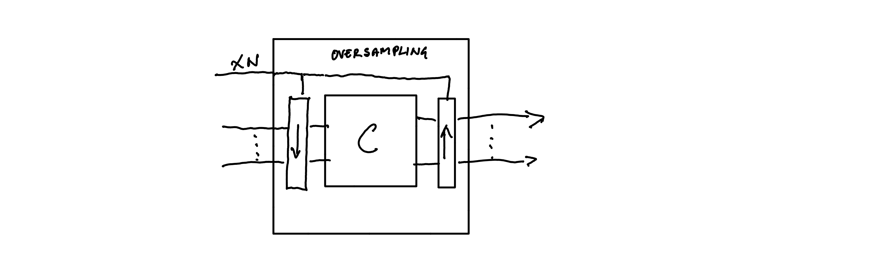

### `oversampling(C)`

Circuit `C` is run $N$ times faster than the surrounding circuit. The _sampling frequency_ observed by `C`, is adjusted proportionally to the oversampling factor.

## Undersampling

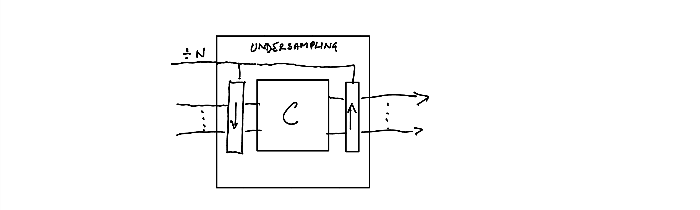

### `undersampling(C)`

Circuit `C` is run $N$ times slower than the surrounding circuit. The _sampling frequency_ observed by `C`, is adjusted proportionally to the undersampling factor.

## Switch

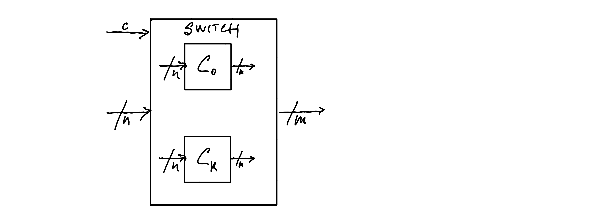

### `switch(C0,C1,...,Ck)`

Activate one of the `Ci` circuits according to the control input `c`. All the circuits must have the same type $n->m$.

## Interleave

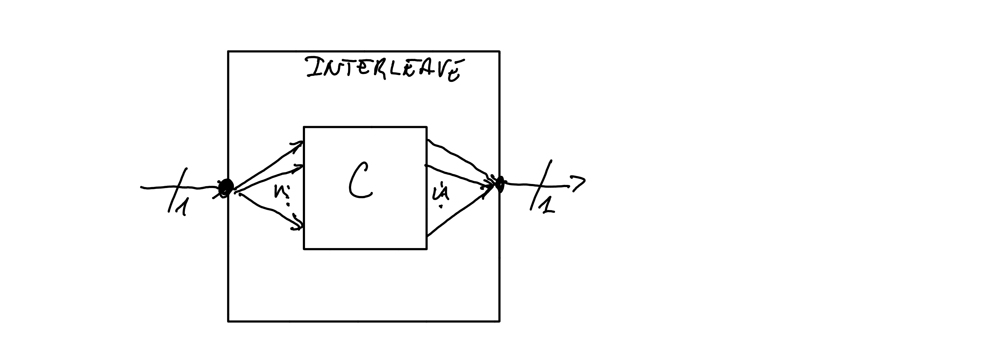

### `interleave(C)`

Assuming `C` is of type $n->n$, `interleave(C)` is of type $1->1$ and operates as follows:

- The incoming samples are distributed sequentially to each of the $n$ inputs of `C`,
- `C` is then executed once, producing $n$ output values.
- These $n$ output values are interleaved back into a single output signal.

## Conclusion

### Ondemand and its variants introduce new perspectives

- Frequency domain computation
- Oversampling and undersampling
- Composition-style, call-by-need computation

### While maintaining

- Code efficiency
- Simple semantics
- Native integration as circuit primitives.
